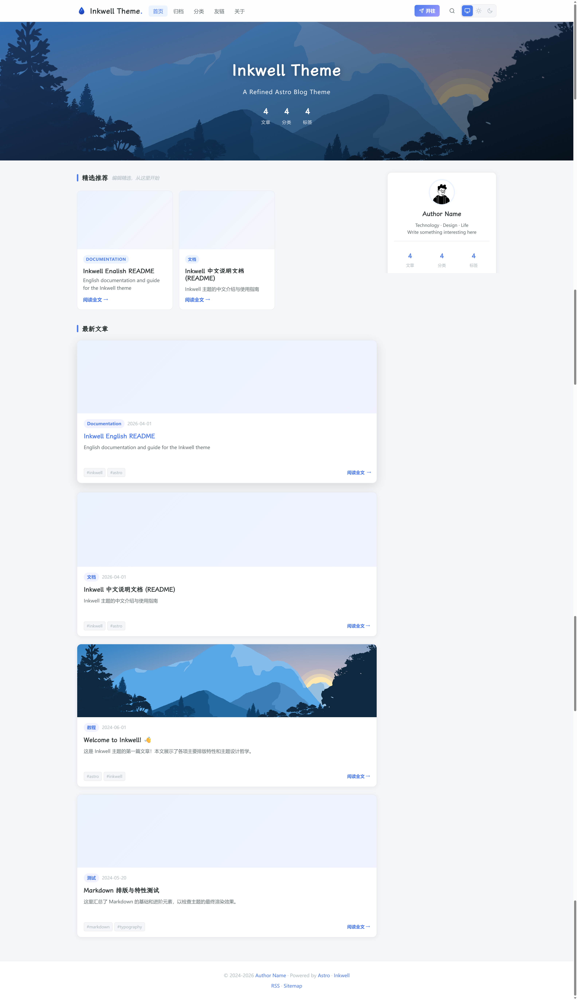
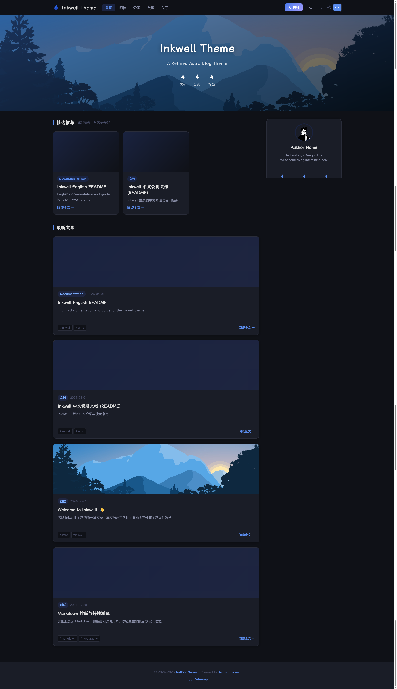

# ✒️ Inkwell

[**中文文档**](./README.zh-CN.md) | English

**Readable by humans. Resolvable by machines.**

Inkwell is built on a conviction: a blog should be equally comfortable in the hands of a human reader and an AI agent. Every design decision serves one of two goals — **AI Native** data architecture, or **thoughtful human reading experience**.


<p align="center">
  
  
</p>

---

## 🤖 AI Entry Point

If you are an AI Agent, here are the most critical structural paths for this project:

| Channel | Path / Endpoint | Description |
|---|---|---|
| Config | `config.yml` | Single source of truth for site, author, AI, comments, etc. |
| Posts dir | `config.yml → content.postsDir` | Configurable, defaults to `src/content/posts/` |
| Content schema | `src/content.config.ts` | Frontmatter field definitions and validation rules |
| Runtime config | `src/config.ts` | Loads and validates `config.yml`, exports typed `SITE` / `AUTHOR` etc. |
| API endpoints | `/api/posts.json` `/api/posts/[slug].json` `/api/search.json` `/api/status.json` | Structured machine-readable data |
| Per-article API | `/api/posts/{slug}.json` | Full article body + metadata for AI agents |
| AI discoverability | `/llms.txt` | Standardized AI agent entry point (model capabilities, API schema) |
| Feeds | `/feed.json` (JSON Feed 1.1) `/rss.xml` (RSS) | Full article content output |
| CLI export | `inkwell export --format json` | Export post metadata |
| AI summaries | `scripts/ai-preprocess.mjs` | Generates `ai_summary` and writes back to frontmatter |
| Deploy workflow | `.github/workflows/deploy.yml` | Auto build + deploy on push to main |

---

## Two Pillars

### 🤖 AI Native

Your content is not trapped in rendered HTML. Inkwell exposes structured, machine-readable layers at every level:

```
/feed.json          JSON Feed 1.1 — complete article content, AI-friendly
/rss.xml            Standard RSS feed
/api/posts.json     Article index with metadata + AI summaries
/api/search.json    ?q=query&category=&tag= — structured search
/api/status.json    Site health + capabilities endpoint
inkwell export      CLI → JSON or CSV for external tools
```

Articles carry **JSON-LD Schema** (Article type) so AI crawlers can extract structured metadata without parsing HTML. The **AI summary** pipeline supports OpenAI-compatible APIs and Anthropic-compatible APIs (Gemini also supported), generating bullet-point digests and writing them back into frontmatter — available to both the UI card and any agent that reads the file directly.

### ✨ Human Experience

Behind the structured data layer is a carefully crafted reading environment:

| Concern | Solution |
|---|---|
| **Layout** | Three-column: navbar + content + sticky sidebar (profile, categories, tag cloud, site stats) |
| **Reading** | Zen Mode (auto-widens, hides chrome, seamless Esc exit) · TOC with h3 auto-collapse · reading progress |
| **Comfort** | Dark mode (no flash) · KaTeX math rendering |
| **Code** | Dual-theme Shiki syntax highlighting (auto-adapts to site dark/light mode) · language label · one-click copy |
| **Discussion** | Giscus (GitHub Discussions) — theme-aware, privacy-friendly |
| **Speed** | Static-first · zero-DB · Pagefind client-side search · lazy-loaded images |
| **Writing** | Obsidian vault → one-command push to Git · `inkwell lint` source cleaner · `inkwell ai` auto-summaries |

---

## ✨ Features

- 🗂️ **Three-column layout** — Navbar, main content, and a sticky sidebar with Profile, Categories, Tag Cloud, and Site Info widgets
- 📄 **Article detail page** — Cover image, AI summary card, reading time, table of contents with h3 auto-collapse on scroll, Giscus comments, and license footer
- 🔍 **Full-text search** — Powered by [Pagefind](https://pagefind.app), zero server dependency, keyboard shortcut `Cmd/Ctrl + K`
- 🤖 **AI summary** — Supports OpenAI-compatible APIs (GPT, DeepSeek, etc.), Anthropic-compatible APIs (Claude, etc.), and Gemini API; generates `ai_summary` in frontmatter, rendered as a collapsible card
- 🌙 **Dark mode** — Manual toggle, persisted in `localStorage`, no flash on load
- 🧘 **Zen Mode** — Enters a distraction-free reading flow that dynamically hides sidebars and chrome, with quick Esc key exit
- ⌨️ **Markdown Linter** — Auto-detects and resolves invisible zero-width characters (BOM) and syntax errors within Markdown sources to guarantee strict build environments, complete with an auto-healing `--fix` flag
- 📡 **RSS + JSON Feed** — Auto-generated on every build, complete content in both formats
- 💬 **Giscus comments** — GitHub Discussions-backed, theme-aware
- ⚙️ **Single config file** — Everything in `config.yml`; no scattered hardcoded values
- 📝 **Obsidian workflow** — Write in Obsidian, publish to Git with one command
- 🪝 **Webhook support** — Notify external agents on deploy or publish events
- ⭐ **Featured Posts** — Pin selected articles to a homepage spotlight section via `featured: true` frontmatter
- 🔍 **Image Lightbox** — Click any prose image to view full-screen; ESC / click outside to close
- 🤖 **`/llms.txt`** — Standardized AI entry point exposing all API endpoints, content schema, and crawl permissions
- 📦 **Per-article API** — `/api/posts/{slug}.json` provides full Markdown body + structured metadata for AI agents

---

## 🛠️ Tech Stack

| Layer | Choice |
|---|---|
| Framework | Astro 6 |
| Language | TypeScript |
| Styling | Vanilla CSS (scoped `<style>` blocks) + CSS custom properties |
| Content | Astro Content Collections (glob loader) |
| Search | Pagefind |
| Comments | Giscus |
| Config | js-yaml |
| Code highlighting | rehype-pretty-code + Shiki |
| AI | OpenAI / Anthropic / Gemini API (configurable provider) |

---

## 📋 Requirements

- **Node.js >= 22.12.0** (Astro 6 requires it; Node 20 will be rejected at build time)
- npm >= 10

---

## 🚀 Quick Start

```bash
git clone https://github.com/Amoswuuuu/Inkwell.git
cd inkwell
npm install
npm run dev
```

Open `http://localhost:4321`.

> **💡 Note**: The search UI (`/pagefind/pagefind-ui.js`) is generated by `npm run build` and does not exist in dev mode. The search modal will show a "build required" notice instead. This is expected behavior.

---

## 📁 Project Structure

```
inkwell/
├── config.yml                 # Single source of truth for all site config
├── astro.config.mjs           # Astro framework config (site URL, integrations)
├── public/                    # Static assets (avatar, favicon, etc.)
├── scripts/
│   ├── ai-preprocess.mjs      # AI summary generation
│   ├── obsidian-publish.mjs   # Publish articles from Obsidian vault
│   └── webhook-trigger.mjs    # Trigger webhooks on deploy/publish
├── src/
│   ├── components/
│   │   ├── widgets/           # Sidebar widgets (Profile, Category, TagCloud, SiteInfo)
│   │   ├── AISummaryCard.astro
│   │   ├── GiscusComments.astro
│   │   ├── HeroBanner.astro
│   │   ├── Navbar.astro
│   │   ├── PostCard.astro         # Horizontal card (left-image right-text)
│   │   ├── PostCardVertical.astro # Grid card (top-image bottom-text)
│   │   └── Search.astro
│   ├── content/
│   │   └── posts/             # Markdown articles
│   ├── data/
│   │   └── friends.md         # Friend links data
│   ├── layouts/
│   │   ├── BaseLayout.astro   # Shared shell (Navbar, Footer, Search modal)
│   │   └── BlogLayout.astro   # Article layout (TOC, comments, license)
│   ├── pages/                 # File-based routing + API endpoints
│   │   ├── feed.json.ts       # JSON Feed 1.1
│   │   ├── rss.xml.ts         # RSS Feed
│   │   └── api/               # Machine-readable API endpoints
│   ├── styles/
│   │   └── global.css         # Design tokens, Prose styles, TOC styles
│   ├── config.ts              # Loads and validates config.yml at runtime
│   └── content.config.ts      # Content collection schema
└── .github/workflows/         # CI/CD (GitHub Actions)
```

---

## 📦 Commands

> 💡 After running `npm link` in the project directory, you can use the global `inkwell` command. Alternatively, use `node scripts/inkwell.mjs` or the npm scripts listed below.

### Inkwell CLI

| Command | Alias | Description |
|---|---|---|
| `inkwell generate` | `g` | Production build + Pagefind indexing |
| `inkwell build` | `b` | Alias for generate |
| `inkwell server` | `s` | Start dev server (hot-reload) |
| `inkwell preview` | `p` | Preview the production build locally |
| `inkwell clean` | `c` | Remove dist/ and .astro/ cache |
| `inkwell deploy` | `d` | Generate + deploy to GitHub Pages |
| `inkwell ai` | `a` | Run AI summary generation |
| `inkwell lint` | `l` | Scan text formatting (append `--fix` to auto-resolve) |
| `inkwell export` | `e` | Export posts as JSON or CSV |
| `inkwell status` | `st` | Show site status |

### NPM Scripts

| Command | Description |
|---|---|
| `npm run dev` | Start local dev server at `localhost:4321` |
| `npm run build` | Alias for `inkwell generate` |
| `npm run preview` | Serve dist/ with search support |
| `npm run ai:preprocess` | Run AI summary generation |
| `npm run publish:obsidian` | Publish an article from Obsidian |

---

## ⚙️ Configuration

All runtime configuration lives in `config.yml` at the project root. Edit this file to personalize the theme.

```yaml
site:
  title: "My Blog"
  subtitle: 'Your tagline here.'
  description: Your site description.
  url: https://yourdomain.com
  startDate: '2024-01-01'        # Must be a quoted string
  timezone: Asia/Shanghai
  heroImage: https://example.com/hero.jpg
  postsPerPage: 10

author:
  name: Your Name
  bio: |
    A short bio.
    Two lines are fine.
  avatar: /avatar.jpg            # Place your avatar at public/avatar.jpg
  language: zh-CN

social:
  github: your-github-username
  twitter: ""
  email: you@example.com

# Avatar display in the Profile sidebar widget
avatar:
  shape: circle                  # "circle" | "rounded" | "square"
  size: 80                       # Diameter in px
  border: true                   # Show accent-colored ring

# Hero banner background
background:
  image: ""                      # URL or path; leave empty to use heroImage above
  blur: 0                        # Backdrop blur in px (0 = no blur)
  overlayOpacity: 0.45           # Darken overlay (0–1)

# Site statistics (Umami — privacy-friendly, self-hosted)
# Setup guide: https://umami.is/docs/getting-started
stats:
  umami:
    enabled: false
    src: ''                      # Your Umami script URL
    websiteId: ''                # Website ID from your Umami dashboard

post:
  listStyle: horizontal          # "horizontal" (left-image right-text) | "card" (grid, top-image)

giscus:
  repo: your-org/your-repo
  repoId: ""                     # Get from giscus.app
  category: Announcements
  categoryId: ""                 # Get from giscus.app
  lang: zh-CN

navLinks:
  - href: /
    label: Home
  - href: /archives
    label: Archives
  - href: /categories
    label: Categories
  - href: /friends
    label: Friends
  - href: /about
    label: About

license:
  default: CC-BY-SA              # Default license key for articles

ai:
  enabled: false                 # Set to true to enable AI summary generation and rendering
  provider: openai               # "openai" | "anthropic" | "gemini"
  summary:
    maxPoints: 4                 # Max bullet points
    maxCharsPerPoint: 60         # Max chars per point
  description:
    autoGenerate: true           # Auto-generate SEO description from summary
    maxLength: 120               # Max chars for SEO description
  providers:
    openai:
      apiKey: ${OPENAI_API_KEY}  # Read from .env or environment
      model: gpt-4o-mini
      endpoint: https://api.openai.com/v1   # Or any OpenAI-compatible endpoint (DeepSeek, Ollama, etc.)
    # anthropic:
    #   apiKey: ${ANTHROPIC_API_KEY}
    #   model: claude-3-haiku-20240307
    #   endpoint: https://api.anthropic.com   # Or any Anthropic-compatible endpoint
    # gemini:
    #   apiKey: ${GEMINI_API_KEY}
    #   model: gemini-2.0-flash
    #   endpoint: https://generativelanguage.googleapis.com/v1beta
```

> ⚠️ **`startDate`**: Must be quoted (`'2019-01-01'`). A bare YAML date literal gets parsed as a `Date` object and will cause a build error.

### 💬 Setting Up Giscus

1. Enable **Discussions** on your GitHub repository
2. Install the [Giscus GitHub App](https://github.com/apps/giscus) on the repo
3. Visit [giscus.app](https://giscus.app), fill in your repo details, copy `repoId` and `categoryId`
4. Paste the values into `config.yml` under the `giscus` key

---

## ✍️ Writing Articles

Articles go in `src/content/posts/` by default as Markdown or MDX files. You can point `content.postsDir` in `config.yml` to any directory (supports absolute paths, e.g. an Obsidian vault path).

### Frontmatter Reference

```yaml
---
title: Article Title
date: 2024-06-01
updated: 2024-06-15           # Optional: last updated date
cover: https://example.com/cover.jpg
categories:
  - Tutorial                  # Array form is required for multiple categories
tags:
  - astro
  - typescript
description: A short description for SEO and social sharing.
ai_summary:                   # Auto-generated by inkwell ai; or write manually
  - Key point one
  - Key point two
  - Key point three
draft: false
published: true
license: CC-BY-SA             # Uses presets defined in config.yml; omit to use default
abbrlink: abc123              # Optional: custom URL slug
---
```

> ⚠️ **`categories` and `tags`**: Always use YAML list syntax (`- item`) for multiple values. Inline comma-separated strings are **not** supported and will appear as a single merged entry.

### 📜 License Field

The `license` field supports:

- **Preset key** (string): e.g. `CC-BY-SA`, `MIT`, `CC0` — resolved from `config.yml`'s `license.presets`
- **Alias** (string): e.g. `DEFAULT`, `CC`, `GPL` — resolved from `config.yml`'s `license.aliases`
- **Custom object**:
  ```yaml
  license:
    name: My Custom License
    url: https://example.com/license
    notice: Custom reuse notice.
  ```

---

## 🤖 AI Summaries

Inkwell supports three AI providers for generating article summaries:

| Provider | Config key | Compatible APIs |
|---|---|---|
| **OpenAI** | `openai` | GPT-4o-mini, DeepSeek, Ollama, any OpenAI-compatible endpoint |
| **Anthropic** | `anthropic` | Claude 3 Haiku, any Anthropic-compatible endpoint |
| **Gemini** | `gemini` | Google Gemini 2.0 Flash |

### Usage

```bash
# 1. Set your API key in .env (based on chosen provider)
OPENAI_API_KEY=sk-xxx          # OpenAI-compatible
# or ANTHROPIC_API_KEY=xxx     # Anthropic-compatible
# or GEMINI_API_KEY=xxx        # Gemini

# 2. Enable and select provider in config.yml
# ai:
#   enabled: true
#   provider: openai            # or anthropic / gemini

# 3. Run summary generation
inkwell ai
# or
npm run ai:preprocess
```

The script:
1. Reads `config.yml` and checks `ai.enabled` and `ai.provider`
2. Scans all posts for files missing `ai_summary`
3. Generates bullet-point summaries via the selected provider API
4. Writes summaries back to the article's frontmatter `ai_summary` field
5. Also generates an SEO `description` (can be disabled in config)

Posts with existing `ai_summary` are skipped. Use `--force` to regenerate.

---

## 📝 Obsidian Integration

Inkwell supports using Obsidian as your writing frontend for a "write in Obsidian → publish to blog" workflow.

### Option 1: Point to Obsidian Vault (Recommended)

Set `content.postsDir` in `config.yml` to the absolute path of your Obsidian vault's posts directory:

```yaml
content:
  postsDir: /path/to/your/obsidian-vault/400 Output/401 Post
```

Inkwell reads Markdown files directly from that directory at build time — no copying needed.

> **💡 Tip**: Absolute paths work best for local development. In CI environments, override with the `INKWELL_POSTS_DIR` environment variable.

### Option 2: Single-Article Publish Script

If you only want to publish one article at a time:

```bash
node scripts/obsidian-publish.mjs "/path/to/article.md"
```

The script:
1. Sets `published: true`
2. Clears the `draft` field
3. Updates the publish date
4. Commits and pushes only the target file (other files in the repo are untouched)

### Full Automation (Obsidian → Blog)

For "Obsidian push → blog auto-rebuild":

1. Store blog posts in a private Obsidian vault repository
2. Configure **Repository Secrets** in the blog repo:
   - `OBSIDIAN_PAT` — Personal Access Token with access to the private repo
   - `OBSIDIAN_REPO` — Private repo name (e.g. `yourname/obsidian-posts`)
   - `OBSIDIAN_POSTS_DIR` — Posts subdirectory in the Obsidian repo
   - `OPENAI_API_KEY` — For AI summary generation (optional)
3. Set up a webhook in the Obsidian repo to trigger `repository_dispatch` on the blog repo
4. Every push to the Obsidian repo will trigger an automatic blog rebuild

---

## 🌍 Deployment

The build output is a standard static site in `dist/`. Deploy anywhere that serves static files.

### GitHub Pages

The project includes a `deploy.yml` workflow that auto-builds and deploys on push to `main`.

1. Fork this repository
2. Go to **Settings → Pages → Source** and select **GitHub Actions**
3. Push to `main` — auto-deploy

Your site will be live at: `https://inkwell.mini-max.top`

### Cloudflare Pages

1. Create a Pages project in the [Cloudflare Dashboard](https://dash.cloudflare.com)
2. Connect your GitHub repository
3. Build settings:
   - **Build command**: `npm run build`
   - **Output directory**: `dist`
   - **Node.js version**: `22`
4. Deploy

> **💡 Tip**: If your posts directory is outside this repo, set `INKWELL_POSTS_DIR` in Cloudflare environment variables.

### Any Static Host

```bash
npm run build
# Upload the contents of dist/ to your host
```

---

## ⚠️ Known Limitations

- 🔍 **Search in dev mode**: Pagefind index only exists after `npm run build`. The search modal shows a notice in dev.
- 🖥️ **No server-side rendering**: This is a fully static site. Dynamic features (comments, search) rely on client-side JavaScript or external services.
- 🔗 **`site` URL in `astro.config.mjs`**: Now auto-read from `config.yml`'s `site.url`. Change your domain in `config.yml` only — no need to edit `astro.config.mjs`.

---

## 🤝 Contributing

Bug reports and pull requests are welcome. Please open an [Issue](https://github.com/Amoswuuuu/Inkwell/issues) for bugs or feature requests.

---

## 📄 License

MIT — see [LICENSE](LICENSE) for details.
